<!--
GitHub Pages draft setup:
This version assumes all screenshot PNG files are in the same folder as index.md.
If screenshots are later moved into docs/screenshots/, replace image paths like
(home-screen-hero.png) with (screenshots/home-screen-hero.png).
-->


# Trainer Fish: Chess Openings Coach
## User Manual and Opening Study Guide

> **Build your opening book. Read PGNs. Search real games. Save the lines that matter.**
>
> Chess Openings Coach helps players harness the power of modern chess technology — opening databases, personal game statistics, engine analysis, and guided repertoire building — to refine their openings and keep up with the way serious players study today.

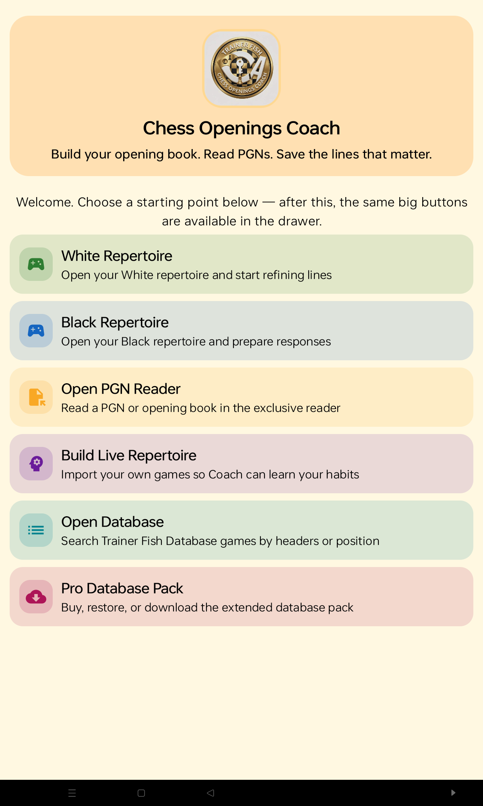

---

## Table of Contents

1. [What Chess Openings Coach Does](#1-what-chess-openings-coach-does)
2. [The Opening Study Philosophy](#2-the-opening-study-philosophy)
3. [From Beth Harmon to Modern Opening Preparation](#3-from-beth-harmon-to-modern-opening-preparation)
4. [Home Screen](#4-home-screen)
5. [Repertoire Screen](#5-repertoire-screen)
6. [PGN Reader](#6-pgn-reader)
7. [Trainer Queen Database](#7-trainer-queen-database)
8. [Live Repertoire and Live Database](#8-live-repertoire-and-live-database)
9. [Backup, Restore, Import, and Export](#9-backup-restore-import-and-export)
10. [Pro Database Pack](#10-pro-database-pack)
11. [Screenshot and Publishing Checklist](#11-screenshot-and-publishing-checklist)

---

## 1. What Chess Openings Coach Does

Chess Openings Coach is more than just a PGN viewer, more than just an engine board, and more than just a database browser. It is a modern opening-study workspace built around one idea:

> **Opening preparation should harness the power of technology by connecting master games, your own games, engine evaluation, and the lines you personally want to remember.**

The app brings those study sources together in one board-centered interface, helping you refine your repertoire the way serious players study today: with databases, statistics, computer analysis, and a personal opening book that grows with your games.

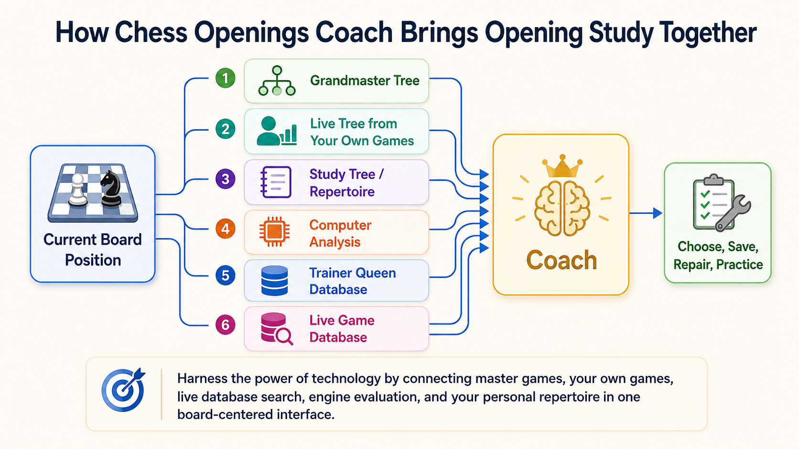

*Chess Openings Coach brings together grandmaster games, your own games, live database search, engine evaluation, and your personal repertoire in one board-centered study workflow.*

### 1.1 Separate White and Black Repertoires

The app keeps your White and Black repertoires separate. This is important because opening study is perspective-based. A line that is excellent for White may be exactly what Black is trying to avoid. A Black repertoire also requires a different mental map from a White repertoire.

Use the repertoire builder to:

- enter moves directly on the board;
- create main lines and variations;
- promote a variation when it becomes your preferred main line;
- delete unwanted branches;
- save practical lines from PGN books, database games, and your own games;
- practice a position against Archer Fish.

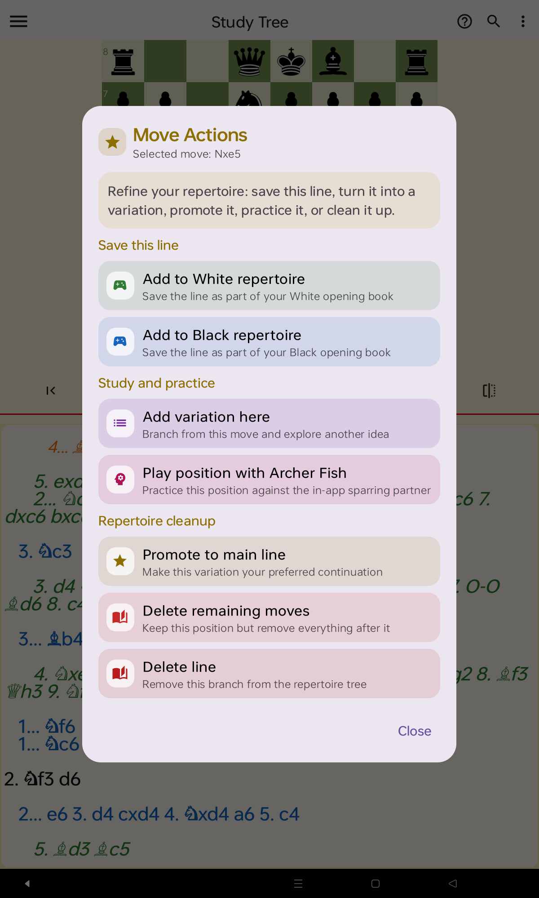

*Long-press any move in the repertoire or PGN Reader to save the line, add it to White or Black, practice it with Archer Fish, promote it to the main line, or clean up unwanted branches.*

### 1.2 Coach Pane

The **Coach** explains the current opening position in human language. It is designed to help you understand what the move statistics mean instead of forcing you to interpret raw tables alone.

Depending on the position and loaded data, the Coach may use:

- Grandmaster Tree move statistics;
- your Live Tree from your own online games;
- your Study Tree / prepared repertoire;
- recent grandmaster games from the current position;
- ECO opening classification;
- engine output when Computer Analysis is on.

The goal is not merely to say "this move is good." The goal is to answer the practical study question:

> **What should I learn here, and why?**

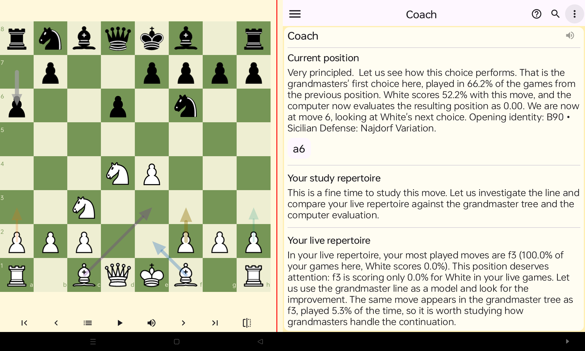

### 1.3 Grandmaster Tree

The **Grandmaster Tree** shows how strong players continued from the current board position. Each move row is designed to answer two different questions:

1. **Popularity:** How often was this move played?
2. **Result profile:** How did games score after this move?

A move that scores well but appears rarely may be an interesting surprise weapon. A move that appears often but scores poorly may require deeper understanding before you trust it. A move that appears often and scores well is usually a strong candidate for your main repertoire.

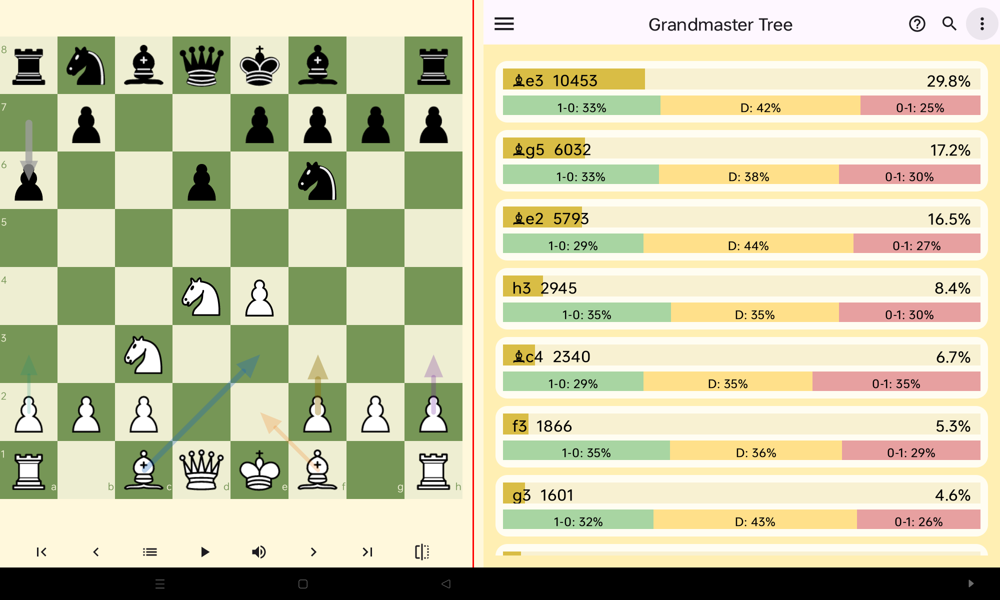

### 1.4 Live Tree: Learn From Your Own Games

The **Live Tree** shows what *you* actually play.

Instead of studying openings only from the outside, you can import your own online games and let the app build a personal move tree. The Live Tree helps answer questions such as:

- What openings do I actually play most often?
- Which lines score well for me?
- Which lines repeatedly lead to bad positions?
- Where do my games leave known theory?
- Which openings deserve repair first?

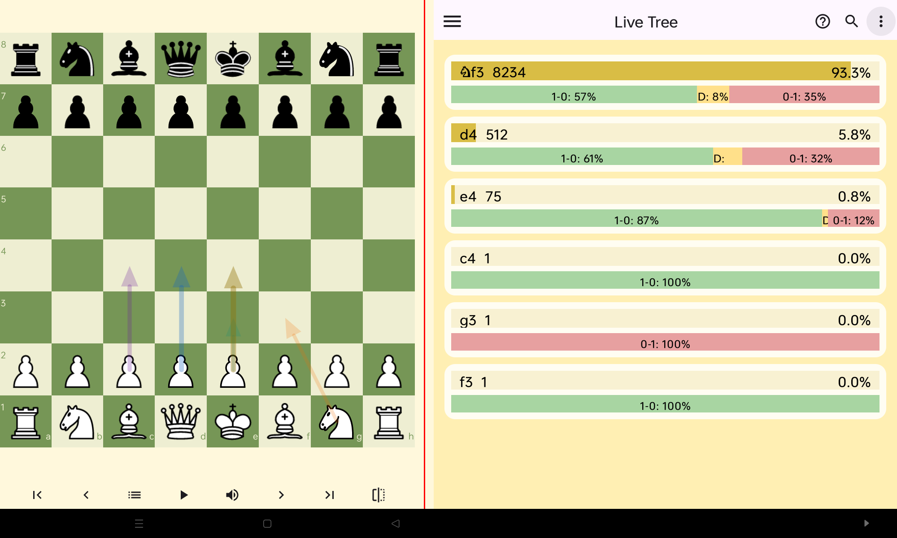

### 1.5 Live Tree Analysis

The app can analyze your live repertoire and summarize patterns in your own games. It can identify your most played openings, your overall score, concentrated repertoires, branching structures, sparse lines, and early-line weaknesses.

A good Live Tree Analysis does not merely tell you what you played. It tells you where your study time is most likely to pay off.


### 1.6 Trainer Queen Database

The built-in database is called **Trainer Queen**. It lets you search games by headers such as player, event, site, ECO, year, rating, and result.

With the Pro Database Pack installed, Trainer Queen becomes a full opening-research tool:

- search real grandmaster games from the exact board position;
- replay complete database games;
- move from database games into the PGN Reader;
- save useful lines into your own repertoire.

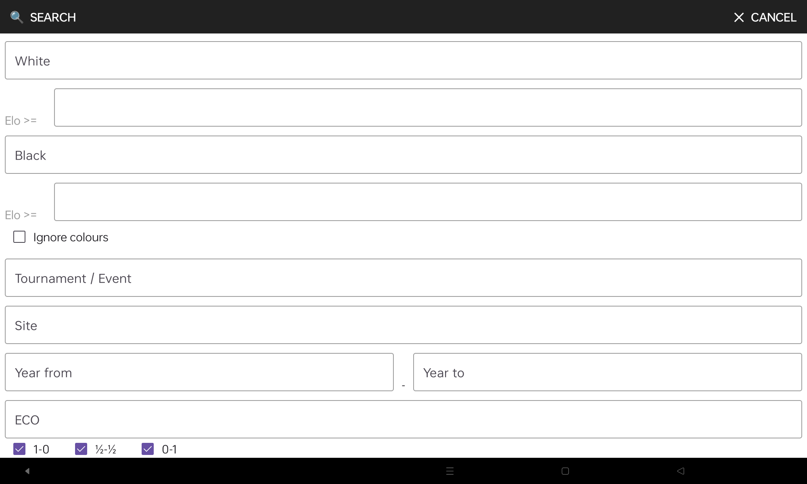

### 1.7 PGN Reader

The **PGN Reader** is built for opening study. It lets you read PGN books, game collections, and database games while keeping the board and reference tools visible.

You can:

- tap a move in the notation to jump to that position;
- use navigation controls to move through the game;
- autoplay the main line;
- flip the board;
- switch between games in a PGN file or search result list;
- use volume buttons for move navigation;
- long-press moves to save lines into your White or Black repertoire;
- add what-if moves and variations;
- save edited copies of read-only database games into your local saved-games file.


### 1.8 Local Computer Analysis

Computer Analysis runs on your device. When the engine is ON, it analyzes the current position continuously until you turn it off, leave the screen, or change the board position.

The board can show engine candidate moves as soft transparent arrows. The strongest candidate is shown most prominently, while other engine lines are shown with lighter emphasis.

Use the engine to check:

- whether a rare move is playable;
- whether a tempting line has a tactical problem;
- whether a database move is outdated;
- whether your own repertoire line needs repair.

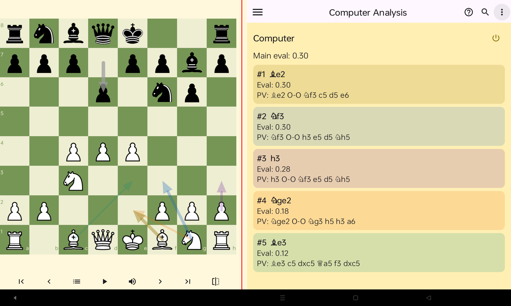

---

## 2. The Opening Study Philosophy

Most players study openings backwards.

They memorize a list of moves, forget the reason behind them, then panic when the opponent deviates. Chess Openings Coach encourages a different method:

> **Do not memorize moves first. Build a living map of positions, choices, and plans.**

### 2.1 The Four Questions of Opening Study

At every important opening position, ask four questions:

| Question | Tool in Chess Openings Coach |
|---|---|
| What do strong players usually play here? | Grandmaster Tree |
| What do I usually play here? | Live Tree |
| What line do I want to remember? | Study Tree |
| Is the move tactically and strategically sound? | Computer Analysis |

The best move for your repertoire is often found by comparing all four answers.

### 2.2 Study Tree vs. Live Tree vs. Grandmaster Tree

These three trees have different jobs.

**Grandmaster Tree** is the outside world. It shows what strong players have done.

**Live Tree** is your chess biography. It shows what you actually do in your games.

**Study Tree** is your chosen repertoire. It is not everything you have ever played. It is what you decide to prepare.

The strongest study happens when these three disagree. For example:

- the Grandmaster Tree says one move is most popular;
- your Live Tree shows you keep playing another move;
- the engine says your move is playable but slightly inaccurate;
- your Study Tree has no prepared answer.

That is not a problem. That is a training target.

### 2.3 The Repertoire Is Not a Museum

A repertoire should not be frozen. It should grow with your games.

When you discover a good idea in a PGN book, save it. When your own games reveal a weakness, repair it. When the engine refutes a line, update it. When the database shows a better model game, study it.

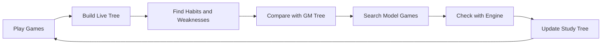
```mermaid
flowchart LR
    A[Play Games] --> B[Build Live Tree]
    B --> C[Find Habits and Weaknesses]
    C --> D[Compare with GM Tree]
    D --> E[Search Model Games]
    E --> F[Check with Engine]
    F --> G[Update Study Tree]
    G --> A
```

### 2.4 Why This Helps Casual Players

Casual players often do not need a 40-move forced line. They need:

- a reliable first 8 to 12 moves;
- clear plans;
- traps to avoid;
- a few model games;
- a way to remember what they actually chose.

A good opening repertoire should reduce confusion, not increase it. The app is designed to make opening study visual, practical, and repeatable.

---

## 3. From Beth Harmon to Modern Opening Preparation

In *The Queen's Gambit*, Beth Harmon receives **Modern Chess Openings** from Mr. Shaibel. The symbolism is perfect: a serious chess student begins by entering the world of opening theory through a thick reference book.

For much of chess history, that was exactly how opening study worked.

### 3.1 The Book Era

In the old style of opening preparation, players relied heavily on printed books and magazines. A book such as *Modern Chess Openings* summarized established theory: main lines, sidelines, evaluations, and opening names.

The method was powerful but static. You studied what the book contained. If a line changed, you waited for a new edition, a magazine note, a tournament bulletin, or a stronger player to show you.

### 3.2 The Database Era

Chess databases changed preparation.

Instead of asking only, "What does the book say?" players could ask:

- Who played this?
- How recent are the games?
- How did high-rated players score?
- Which move became popular after this tournament?
- Can I find model games from this exact position?

This is the world represented by the Grandmaster Tree and Trainer Queen database. The opening is no longer a fixed chapter in a book. It is a living record of games.

### 3.3 The Engine Era

Engines changed opening study again.

A database tells you what humans played. An engine helps you test whether the move survives objective analysis.

But engines must be used wisely. A computer may prefer a move that is difficult for humans to understand. A database move may score well because the positions are easier to play. A practical repertoire balances both.

### 3.4 The Personal Repertoire Era

Modern players have something Beth Harmon did not have in the 1960s setting: instant access to their own online games.

Your mistakes are no longer vague memories. They can become a Live Tree. Your habits can be measured. Your weak openings can be found. Your repertoire can be repaired based on the positions that actually happen in your games.

> **From opening book, to game database, to engine analysis, to your own living repertoire.**

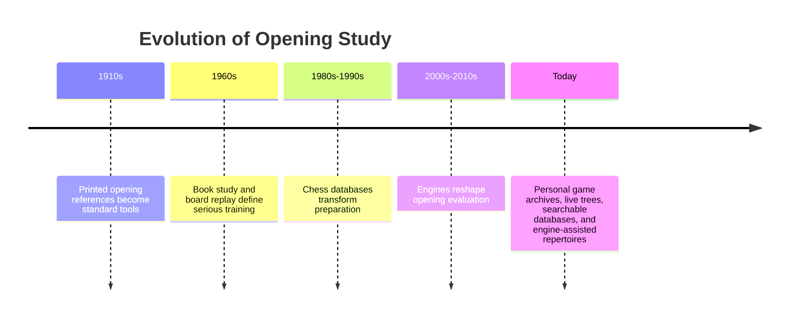
```mermaid
timeline
    title Evolution of Opening Study
    1910s : Printed opening references become standard tools
    1960s : Book study and board replay define serious training
    1980s-1990s : Chess databases transform preparation
    2000s-2010s : Engines reshape opening evaluation
    Today : Personal game archives, live trees, searchable databases, and engine-assisted repertoires
```

---

## 4. Home Screen

The Home Screen is the launch pad.


The main actions are presented as large, colorful cards.

### 4.1 White Repertoire

Open this when you want to build or review your opening choices as White.

Good uses:

- prepare your first-move systems;
- build responses to Black defenses;
- save lines from PGN books;
- compare your choices with the Grandmaster Tree;
- check your line with the engine.

### 4.2 Black Repertoire

Open this when you want to prepare against White's first moves.

Good uses:

- build a reply to 1.e4;
- build a reply to 1.d4;
- prepare against sidelines;
- keep Black lines separate from White lines;
- study from Black's perspective.

### 4.3 Open PGN Reader

Open this when you want to study:

- a PGN opening book;
- a game collection;
- a database game;
- an annotated line;
- a model game.

The PGN Reader is ideal when your first task is reading, not editing.

### 4.4 Build Live Repertoire

Use this when you want the app to learn from your games.

A Live Repertoire can be built from your online games and separated by color. It can later be compared against master play and searched as a live database.

### 4.5 Open Database

Open the Trainer Queen database to search for games by header or position.

Use this when you want to find real games by player, event, ECO, year, rating, result, or exact board position.

### 4.6 Pro Database Pack

Open this when you want to buy, restore, download, or check the status of the Pro Database Pack.

Pro is recommended for users who want serious database-assisted study rather than only lightweight repertoire editing.

---

## 5. Repertoire Screen

The Repertoire Screen is the main training room.

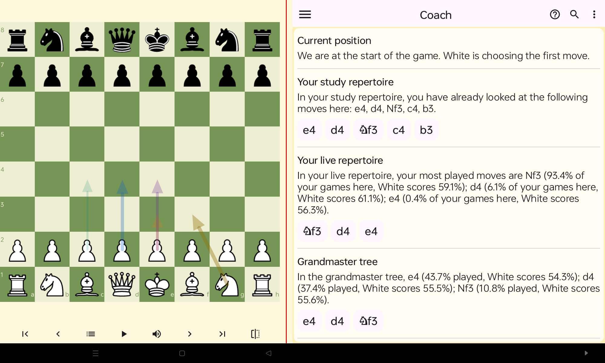

It has three main zones:

1. **Chess board** - the current position.
2. **Bottom or side pane** - Coach, trees, recent games, or engine output.
3. **Drawers and controls** - navigation, database search, visual customization, and mode switching.

### 5.1 Board Controls

To enter a move:

1. Tap the piece.
2. Tap the destination square.
3. If a pawn promotes, choose the promotion piece.

The board can display:

- last-move arrows;
- user highlights;
- user arrows;
- engine candidate arrows;
- board coordinates;
- custom board colors;
- custom piece sets.

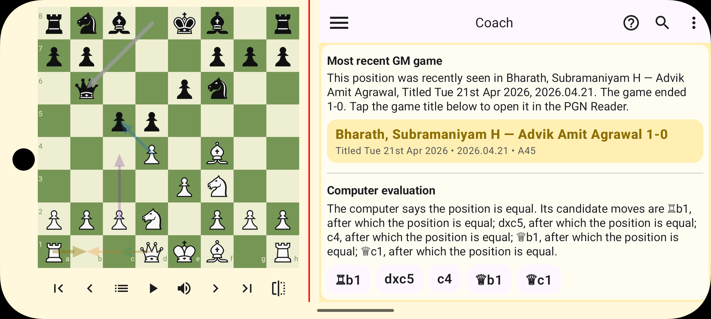

### 5.2 The Red Splitter Bar

The red splitter lets you resize the board and the study pane.

In portrait, drag the red bar up or down. In landscape, drag it left or right. The pane text scales with the available space, so you can give more room to the board or more room to the explanation depending on what you are doing.


### 5.3 Left Drawer

The left drawer is the main navigation center. It gives access to the app's major modes and study panes.

Use it to switch between:

- White Repertoire;
- Black Repertoire;
- PGN Reader;
- Build Live Repertoire;
- Live Tree Analysis;
- Trainer Queen Database;
- Pro Database Pack.

### 5.4 Coach Pane

The Coach is the best default pane for practical study. It converts the data into human-readable guidance.

It may point out:

- popular grandmaster moves;
- moves from your own Live Tree;
- current Study Tree choices;
- engine-supported moves;
- recent grandmaster games;
- opening name and ECO information;
- repertoire gaps.


### 5.5 Grandmaster Tree Pane

Use the Grandmaster Tree when you want master-game evidence.

A move with high popularity usually means the position is well known. A move with low popularity may still be playable, but you should examine it carefully.

The win/draw/loss bars help you see whether the resulting positions have historically favored White, Black, or neither.

### 5.6 Live Tree Pane

Use the Live Tree when you want to see your own habits.

The Live Tree may surprise you. Many players think they have a repertoire, but their games reveal that they improvise, repeat mistakes, or avoid certain structures.

### 5.7 Recent GM Games Pane

The Repertoire Screen can show recent grandmaster games from the current position. This lets you move from a position to model games quickly.

Typical workflow:

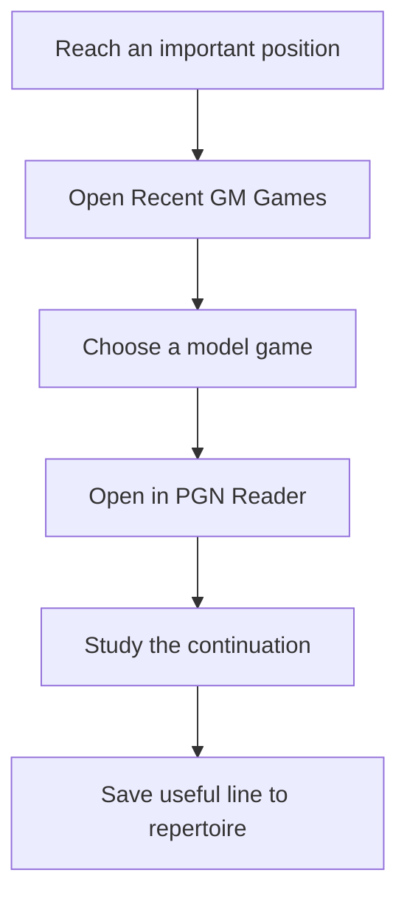
```mermaid
flowchart TD
    A[Reach an important position] --> B[Open Recent GM Games]
    B --> C[Choose a model game]
    C --> D[Open in PGN Reader]
    D --> E[Study the continuation]
    E --> F[Save useful line to repertoire]
```

### 5.8 Study Tree Pane

The Study Tree is your editable opening notebook.

Long-press a move to access actions such as:

- add to White repertoire;
- add to Black repertoire;
- add variation here;
- play the position with Archer Fish;
- promote to main line;
- delete remaining moves;
- delete line.

The Study Tree uses PGN-style main lines and variations, so it remains natural for chess study.

### 5.9 Computer Analysis Pane

Use Computer Analysis when you need calculation support.

Good times to turn the engine on:

- after leaving known theory;
- when a move looks suspicious;
- when two database moves both look playable;
- when your Live Tree shows a line scoring badly;
- when building a serious Pro-level repertoire.

The engine is a guide, not a dictator. For opening study, compare engine evaluation with human results and your own comfort.

### 5.10 Database Search From the Current Position

Use the search icon to search for representative database games from the current board position.

This is one of the strongest workflows in the app:

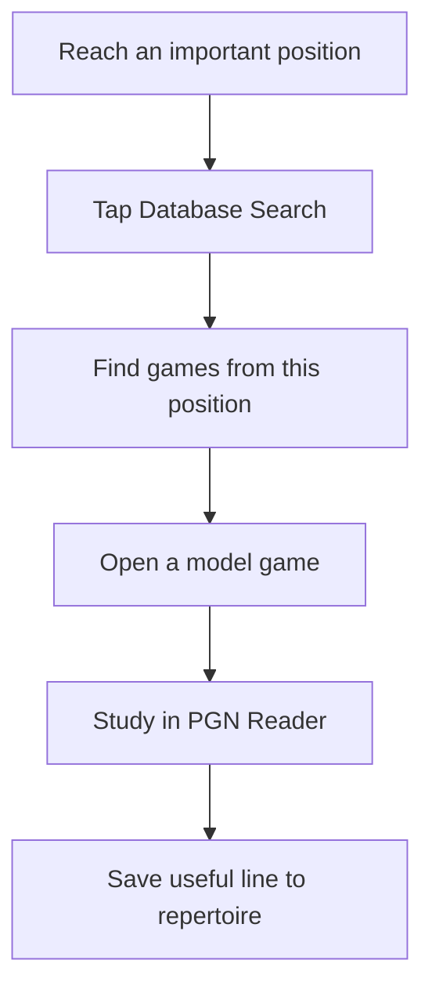
```mermaid
flowchart TD
    A[Reach an important position] --> B[Tap Database Search]
    B --> C[Find games from this position]
    C --> D[Open a model game]
    D --> E[Study in PGN Reader]
    E --> F[Save useful line to repertoire]
```

### 5.11 Visual Customization

The app includes multiple:

- app color schemes;
- board color sets;
- chess piece styles.

Use the visual drawer to create a board and study environment you enjoy. Opening study is easier when the workspace feels pleasant enough to return to every day.

---

## 6. PGN Reader

The PGN Reader is for studying opening books, game collections, and database games.

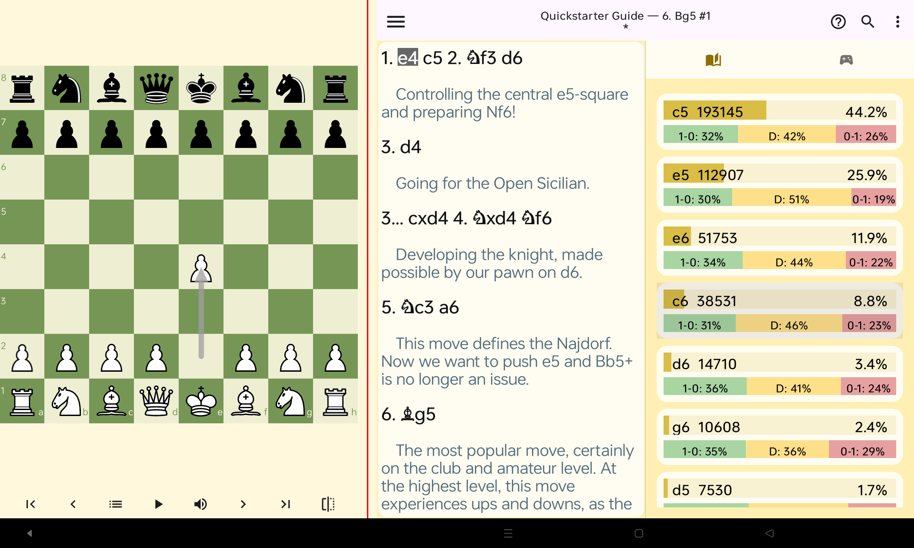

### 6.1 When to Use PGN Reader

Use PGN Reader when you want to:

- read an opening book in PGN format;
- replay annotated games;
- study model games;
- browse a PGN collection;
- inspect a database game;
- save one useful line into your own repertoire.

### 6.2 Reading Moves

Tap a move in the notation to jump directly to that position.

This makes the PGN Reader useful for opening books with many variations. You can move around the notation without repeatedly pressing Next.

### 6.3 Navigation Controls

The reader includes controls for:

- previous move;
- next move;
- first move;
- last move;
- previous source game;
- next source game;
- game list;
- board flip.

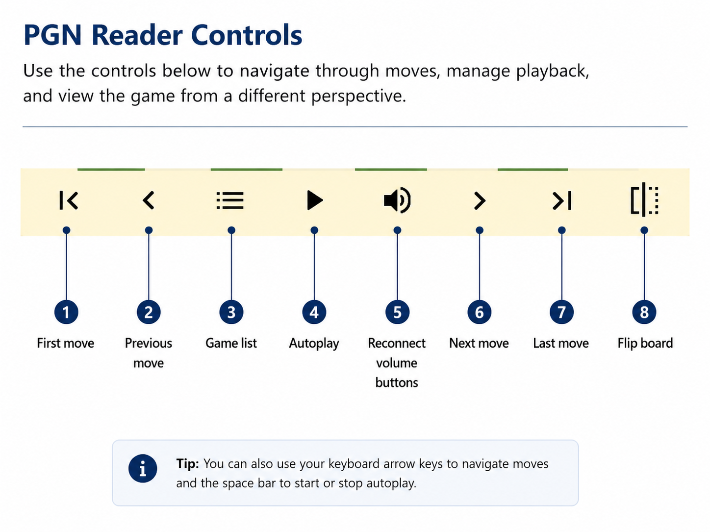

### 6.4 Autoplay

Tap Play to autoplay the main line. Autoplay advances one move every two seconds. Tap again to stop.

This is useful for quickly absorbing the shape of an opening line before studying details.

### 6.5 Volume Button Navigation

The PGN Reader can connect the phone's volume buttons to move navigation:

- **Volume Up:** next move;
- **Volume Down:** previous move.

If Android returns to normal volume adjustment, tap the reconnect button in the reader controls.

### 6.6 Right Pane: Grandmaster Tree or Computer Analysis

In PGN Reader mode, the right pane can show either:

- **Grandmaster Tree** - read-only reference for master-game statistics;
- **Computer Analysis** - local engine suggestions.

This makes the PGN Reader more than a notation viewer. You can read a line, compare it to master practice, and check it tactically without leaving the screen.

### 6.7 Saving Lines From PGN Reader

Long-press a move to save the line into your White or Black repertoire.

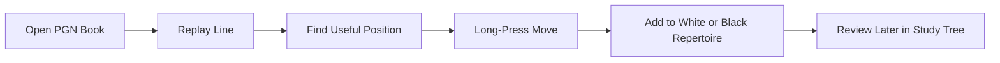
```mermaid
flowchart LR
    A[Open PGN Book] --> B[Replay Line]
    B --> C[Find Useful Position]
    C --> D[Long-Press Move]
    D --> E[Add to White or Black Repertoire]
    E --> F[Review Later in Study Tree]
```

### 6.8 Adding What-If Moves and Variations

In PGN Reader mode, you can enter moves on the board. These moves are recorded into the opened PGN Reader game as continuations or variations.

This is useful when you ask:

- What if Black does not follow the book?
- What if I choose a simpler move?
- Can I save this practical shortcut for later?

### 6.9 Saving Edited Games

Read-only sources such as Trainer Queen database games are protected. When you edit a database game, the source database is not changed.

Instead, Chess Openings Coach can save an edited copy into a local saved-games PGN collection. This gives you the freedom to annotate, explore, and preserve your own version without damaging the original source.

### 6.10 Database Search Result Navigation

When a Trainer Queen or Live Online database search opens a game in PGN Reader, the reader remembers the current result list. You can move to the previous or next source game without repeating the search.

This is powerful for studying several model games from the same position.

---

## 7. Trainer Queen Database

Trainer Queen is the built-in game database system.


### 7.1 Header Search

You can search by:

- White player;
- Black player;
- Event;
- Site;
- ECO code;
- free text;
- year range;
- rating minimums;
- result filter;
- color-specific or ignore-colors search.

This is useful when you want to find games by player, opening, tournament, or rating range.

### 7.2 Recent Games

The database can show recent games, sorted by date. This helps you study modern examples rather than relying only on older theory.

### 7.3 Position Search

With Pro installed, you can search games from the exact board position. This is one of the most important Pro workflows.

Instead of guessing which opening variation name to search for, you simply reach the position and ask:

> **Who has played this exact position, and what happened next?**

### 7.4 Full Game Replay

With Pro installed, you can open and replay complete database games. From there, the PGN Reader can be used to inspect the game, compare the position with the Grandmaster Tree, check the engine, and save useful lines.

### 7.5 Trainer Queen and the Coach

Trainer Queen also improves the Coach because the Coach can surface recent grandmaster games and use richer opening context in its explanations.

---

## 8. Live Repertoire and Live Database

Your own games are the most personal opening database you have.

Chess Openings Coach lets you build a Live Repertoire from online games, then use it as a study tree and searchable game source.

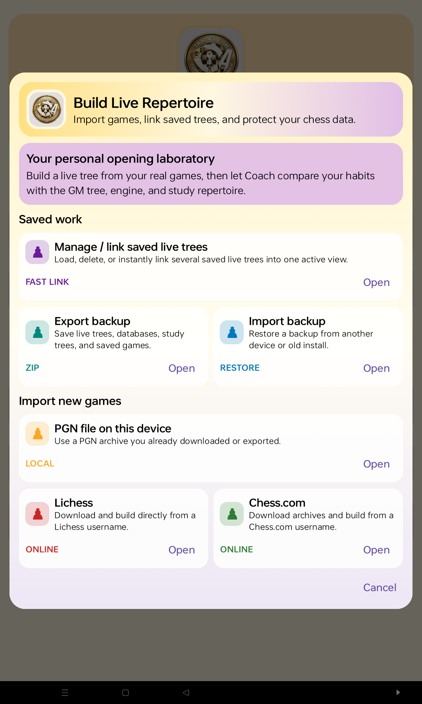

### 8.1 Building a Live Repertoire

A Live Repertoire can be built from your online games. The app separates the data into White and Black so you can study your habits from each side.

The builder tracks useful information such as:

- total source games;
- limited games processed;
- matched and unmatched games;
- parsed and skipped games;
- position count;
- move count.

### 8.2 Optional Live Game Database

A Live Repertoire can also include a companion Live Online Game Database. This database is stored beside the live tree bundle and keeps searchable copies of your imported games.

This allows workflows such as:

- search your own games by header;
- search your own games from a position;
- open your own game in PGN Reader;
- compare your own games with grandmaster games.

### 8.3 Linking Live Databases

Recent builds support linked live databases. Instead of copying every PGN into one giant merged file, a unified live tree can link back to the original database sources.

This keeps merging fast and avoids unnecessary duplication.

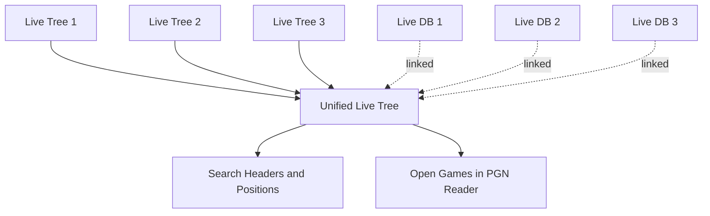
```mermaid
flowchart TD
    A[Live Tree 1] --> D[Unified Live Tree]
    B[Live Tree 2] --> D
    C[Live Tree 3] --> D
    A1[Live DB 1] -. linked .-> D
    B1[Live DB 2] -. linked .-> D
    C1[Live DB 3] -. linked .-> D
    D --> E[Search Headers and Positions]
    D --> F[Open Games in PGN Reader]
```

### 8.4 Live Database Booster

When multiple live databases are linked, the app can silently create a lightweight header booster. The booster does not copy the PGN shards and does not rebuild the entire position index. It creates one fast header table so searches do not have to query every linked database separately.

The result is simple for the user:

> **Linked live databases stay fast without asking the user to manage technical details.**

### 8.5 Live Tree Analysis

Live Tree Analysis turns your personal games into recommendations. It can highlight:

- your most played openings;
- your total score by side;
- forcing positions;
- branching positions;
- sparse positions;
- common early weaknesses;
- repair recommendations.

Use this when you want to decide what to study next.

### 8.6 Comparing Live Tree and Grandmaster Tree

A powerful study question is:

> **Do I play what strong players play, or am I repeatedly choosing something else?**

If your Live Tree shows a different move from the Grandmaster Tree, that does not automatically mean your move is bad. But it does mean the position deserves attention. Check a few model games, turn on the engine, and decide whether your Study Tree should be updated.

---

## 9. Backup, Restore, Import, and Export

Opening work is valuable. A serious repertoire can represent many hours of study. Chess Openings Coach includes backup and restore tools so your work can survive reinstalling the app, changing devices, or testing beta builds.


### 9.1 What Can Be Backed Up

A backup can include:

- Study Tree / repertoire files;
- Live Tree files;
- Live Online Game Databases;
- saved edited PGN Reader games;
- optional visual settings.

### 9.2 Selective Export

You do not always need to export everything. A selective export lets you choose what kind of data to preserve.

For example:

- export only Study Trees when you want a light repertoire backup;
- export Live Trees and Live Databases when moving your own game archive to another device;
- export saved games when preserving edited PGN Reader material.

### 9.3 Import Preview

Before restoring, the app can preview what the backup contains. This helps prevent accidental confusion between Study Trees, Live Trees, Live Databases, and saved games.

A good restore workflow should answer:

- Does this backup contain Study Trees?
- Does it contain Live Trees?
- Does it contain Live Databases?
- Does it contain saved edited games?
- How many live bundles are inside?

### 9.4 Safe Restore Mode

Safe restore mode does **not** automatically overwrite everything on the device.

If replace mode is off, existing files are kept and only missing files are restored. This protects your current work.

### 9.5 Replace Existing Mode

Replace Existing mode is stronger. It clears selected categories first, then restores the selected categories from the backup.

Use this only when you are sure the backup should replace the data currently on the device.

### 9.6 Recommended Backup Habits

Before uninstalling, reinstalling, or testing a major new build:

1. Export your Study Trees.
2. Export your Live Trees.
3. Include Live Databases if you built them.
4. Include saved games if you edited database or PGN Reader games.
5. Keep the backup zip in cloud storage or your computer.

---

## 10. Pro Database Pack

The free app is already useful for building repertoires and reading PGNs. The **Pro Database Pack** turns the app into a deeper opening laboratory.

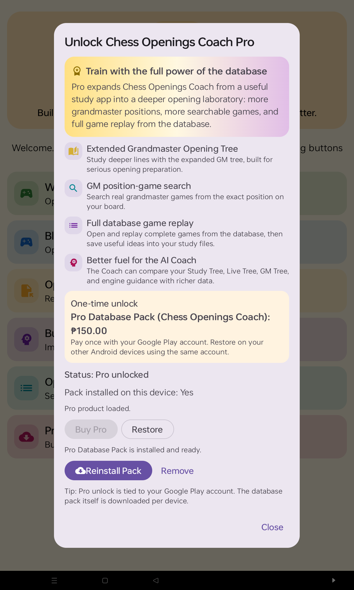

### 10.1 What Pro Unlocks

Pro unlocks:

- the extended Grandmaster Opening Tree;
- GM position-game search from the exact board position;
- full database game replay;
- richer database material for the Coach;
- a stronger workflow from position, to model game, to saved repertoire line.

### 10.2 Why Go Pro?

Opening study becomes much more powerful when you can move from a board position directly into real master games.

Free mode is enough to start building. Pro is for the player who wants to ask deeper questions:

- What did strong players do from this exact position?
- Are there recent master games in this line?
- Which model game should I study?
- Can I replay the full game and save the useful part?
- Does my personal Live Tree agree with modern grandmaster practice?

### 10.3 One-Time Unlock

The Pro Database Pack is designed as a one-time unlock through Google Play. After purchase, you can restore on your other Android devices using the same Google Play account.

### 10.4 Downloading the Pro Pack

After buying or restoring Pro, download the database pack from the Pro dialog. The pack includes separate database assets, so the app can stay small while Pro users can install the larger opening-study material.

### 10.5 Legitimate Purchases on Huawei / Aurora Devices

The anti-piracy guard is designed to protect the Pro database files. However, it also recognizes a legitimate Pro purchase even if the device reports a non-Play installer. This helps Huawei/Aurora users who purchased Pro through Google Play restore/download the Pro pack without being unfairly blocked.

### 10.6 Pro Workflow Example

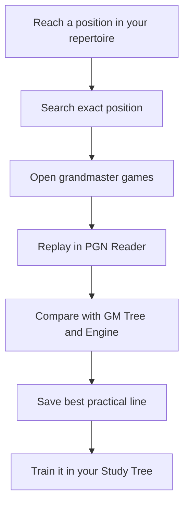
```mermaid
flowchart TD
    A[Reach a position in your repertoire] --> B[Search exact position]
    B --> C[Open grandmaster games]
    C --> D[Replay in PGN Reader]
    D --> E[Compare with GM Tree and Engine]
    E --> F[Save best practical line]
    F --> G[Train it in your Study Tree]
```

### 10.7 Pro Is Not Just More Data

The most important Pro benefit is not the number of games. It is the workflow.

Pro helps you turn a position into a research question, then turn the answer into your own prepared line.

---

## 11. Screenshot and Publishing Checklist

Before publishing the GitHub Pages manual and downloadable PDF, capture production screenshots with the final build.

### 11.1 Required Screenshots

1. `screenshots/home-screen-hero.png`
2. `screenshots/home-screen.png`
3. `screenshots/repertoire-screen-overview.png`
4. `screenshots/repertoire-white-coach.png`
5. `screenshots/coach-pane.png`
6. `screenshots/coach-move-chips.png`
7. `screenshots/gm-tree-bars.png`
8. `screenshots/live-tree.png`
9. `screenshots/live-tree-analysis.png`
10. `screenshots/build-live-repertoire.png`
11. `screenshots/board-arrows.png`
12. `screenshots/computer-analysis.png`
13. `screenshots/pgn-reader.png`
14. `screenshots/pgn-reader-main.png`
15. `screenshots/pgn-reader-controls.png`
16. `screenshots/trainer-queen-search.png`
17. `screenshots/backup-restore-dialog.png`
18. `screenshots/pro-dialog.png`

### 11.2 Optional Screenshots

- portrait Repertoire Screen on a 6-inch phone;
- landscape PGN Reader with analysis pane;
- Pro locked feature prompt;
- Live Tree Analysis recommendations;
- Recent GM Games pane;
- visual customization drawer;
- saved edited game workflow.

### 11.3 GitHub Pages Publishing Notes

For GitHub Pages, the easiest structure is:

```text
/docs
  index.md
  /screenshots
    home-screen-hero.png
    repertoire-screen-overview.png
    pgn-reader-main.png
    pro-dialog.png
```

If using Mermaid diagrams, enable Mermaid support through your GitHub Pages theme or convert the diagrams into images before publishing.

### 11.4 PDF Publishing Notes

The downloadable PDF should be produced from the same source content, but with:

- embedded screenshots instead of placeholder links;
- diagrams converted to images or simplified flowcharts;
- a cover page;
- a table of contents;
- a final Pro call-to-action page.

Recommended download locations:

- GitHub Releases; or
- Cloudflare / R2 mirror; or
- both, using one as fallback.

---

## Suggested Next Manual Sections

The next revision can add:

12. Step-by-step: building a Live Repertoire from online games
13. Step-by-step: creating a Pro opening research session
14. Step-by-step: saving model-game lines into White or Black repertoire
15. Archer Fish practice mode
16. Visual customization guide
17. Troubleshooting
18. FAQ
19. Beta tester notes and production release notes
20. Privacy and local data storage notes

